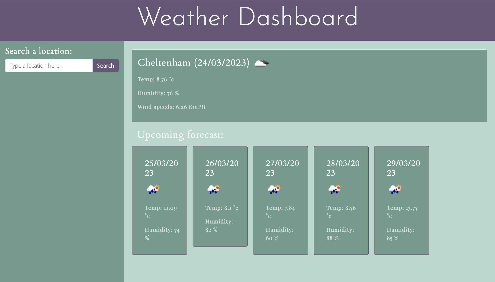

## Calendar Application - Work Schedule

## **What**
This project required me to cbuild a weather dashboard to run in the browser, featuring dynamically updating HTML and CSS. I had to use an API to retrieve data from a separate server API and use it in the context of my own app - in this case, a weather API.

The app was created with the following **User Story** in mind:

* AS A traveler
* I WANT to see the weather outlook for multiple cities
* SO THAT I can plan a trip accordingly

## **How**
In order to create a user friendly and functioning app, I needed to include the following features:

* Create a weather dashboard with form inputs.
* When a user searches for a city they are presented with current and future conditions for that city and that city is added to the search history.
* When a user views the current weather conditions for that city they are presented with:
* The city name
* The date
* An icon representation of weather conditions
* The temperature
* The humidity
* The wind speed
* When a user views future weather conditions for that city they are presented with a 5-day forecast that displays:
* The date
* An icon representation of weather conditions
* The temperature
* The humidity
* When a user clicks on a city in the search history they are again presented with current and future conditions for that city.

I tweaked some of the CSS to improve my own learning, although this wasn't part of the challenge that was set.

## **Result**

## **Links**

The GitHub repository link:

https://github.com/Nikki1162/weather-dashboard

The live application:

https://nikki1162.github.io/weather-dashboard/